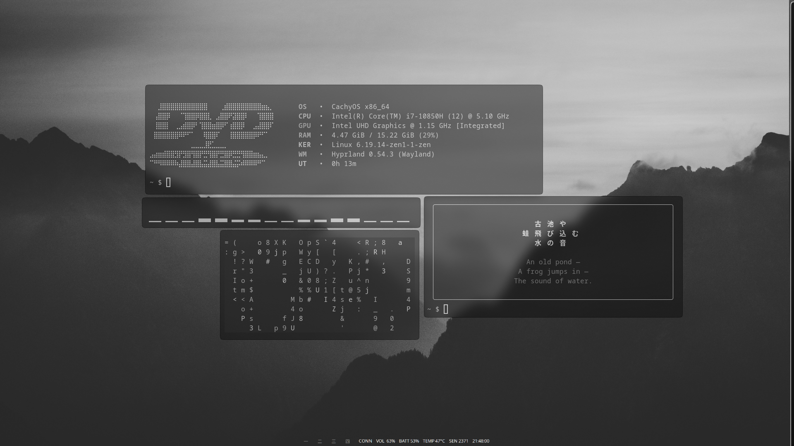

## Monochrome-Rice
A minimalist, high-contrast black-and-white configuration for Hyprland on CachyOS. Designed for focus, speed, and a clean aesthetic.
Components

## Screenshots



## Details
- **OS:** CachyOS
- **WM:** Hyprland
- **Terminal:** Alacritty
- **Colors:** Monochrome 

## Aesthetics
The theme utilizes a strict **Monochrome** palette:
* **Background:** `#000000` (Pure Black)
* **Foreground:** `#FFFFFF` (Pure White)
* **Accents:** High-contrast greyscale tones for UI depth.

## Dependencies
To get this rice working, you'll need the following packages:

## Fast Setup (Deployment)
Since this is a Arch-based rice, you can test these configurations by adding the files to your ~/.config/ directory.
Manual Setup

1. Clone the repository
```bash
git clone https://github.com/bilalElGohary/Monochrome-Rice.git
cd Monochrome-Rice
```

2. Move the config files to your local directory
```bash
cp DotFiles/.config/* ~/.config/
```

### Install Core Packages (Official Repos)

1. Arch
```bash
sudo pacman -S --needed alacritty rofi-wayland waybar swww hypridle hyprlock git micro firefox dunst
# Use an AUR helper for these:
yay -S wlogout hyprshot
```
2. Fedora
```bash
sudo dnf install alacritty rofi-wayland waybar swww hypridle hyprlock wlogout git micro firefox dunst
```
3. Ubuntu / Debian
```bash
sudo apt update && sudo apt install alacritty rofi waybar git micro firefox dunst
# Note: hyprlock/swww may require manual compilation on older versions
```
4. Nixos
```bash
environment.systemPackages = with pkgs; [
  alacritty
  rofi-wayland
  waybar
  swww
  hypridle
  hyprlock
  wlogout
  hyprshot
  micro
  firefox
  dunst
];
```

# Special Thanks
  Thanks for checking out my setup! If you find this useful, don't forget to star the repository. Keep ricing

---
## Get in touch
[](https://github.com/bilalElGohary)
